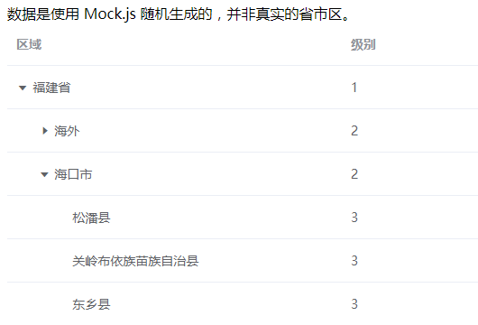

# vue-element-tree

> 基于 `element-ui` 的表格组件，实现的一个树形结构展示。

## Build Setup

``` bash
# install dependencies
npm install

# serve with hot reload at localhost:8080
npm run dev
```
> 思路就是把子集的数据都取到顶级用于表格展示，关闭的时候从顶级移除就可以了。
- 效果预览如下：

  
